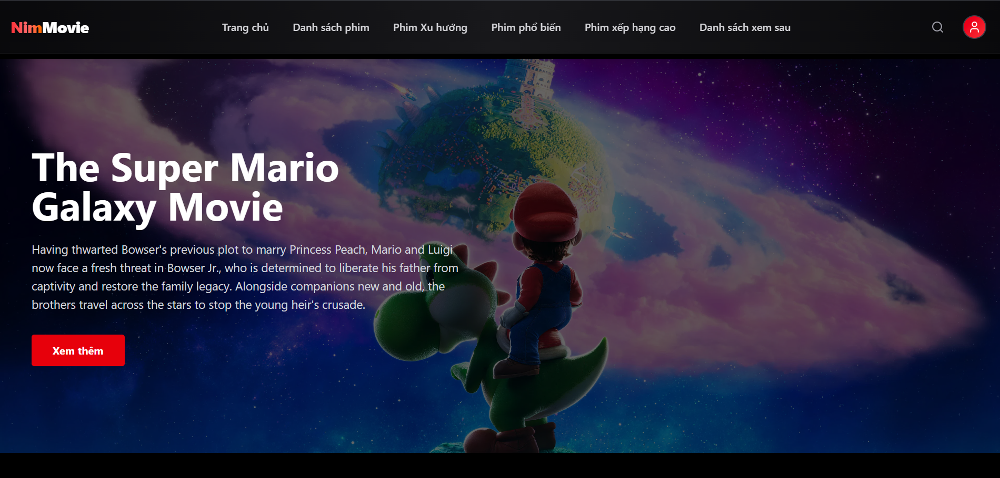
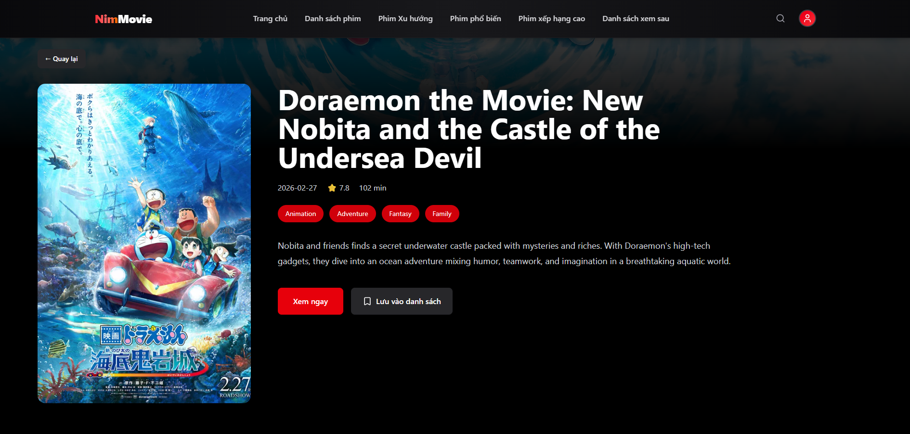
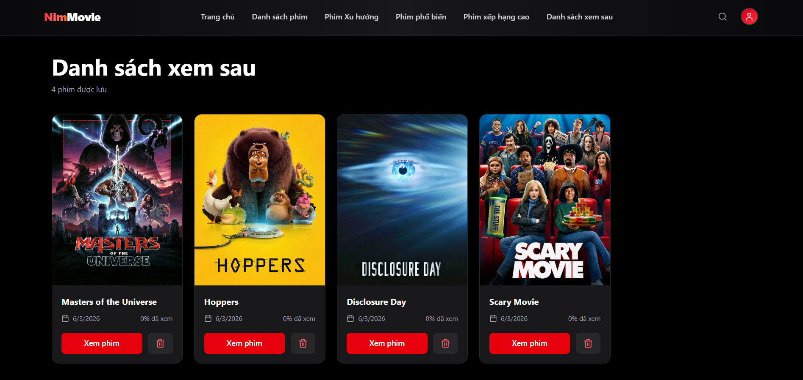

<div align="center">

# 

**AI-Powered Movie Streaming & Recommendation Platform**

<p>
  
  
  
  
  
</p>

<p>
  <a href="https://nim-movie.vercel.app">
    
  </a>
  <a href="https://nim-movie-production.up.railway.app/docs">
    
  </a>
</p>

</div>

---

## 📖 Overview

NimMovie is a modern movie streaming and recommendation platform inspired by Netflix, built with **FastAPI**, **React**, and **PostgreSQL**. It provides movie discovery, watchlist management, user reviews, and an **AI-powered RAG assistant** capable of answering movie-related questions and generating personalized recommendations through natural language interactions.

The application is deployed on **Vercel**, **Railway**, and **Supabase PostgreSQL** with a production-ready architecture.

---

## 🖼️ Screenshots

### 🏠 Home



### 🎬 Movie Detail



### 📚 Watchlist



### 🤖 AI Chatbot


---

## 🚀 Features

### 🎥 Movie Platform

* Browse Trending, Popular, Top Rated Movies
* Advanced Search & Discovery
* Movie Details, Trailer & Cast Information
* Personal Watchlist Management
* User Reviews & Ratings

### 🤖 AI Assistant

* Natural Language Movie Recommendations
* Retrieval-Augmented Generation (RAG)
* Vector Search with pgvector
* Citation-Based Responses
* Real-Time Streaming via SSE

### 🔐 Security

* JWT Authentication
* Password Hashing (bcrypt)
* Role-Based Access Control (RBAC)
* Protected Frontend Routes

---

## ⚙️ Tech Stack

| Frontend     | Backend    | AI & Data |
| ------------ | ---------- | --------- |
| React 19     | FastAPI    | OpenAI    |
| Vite         | SQLAlchemy | Gemini    |
| Tailwind CSS | Pydantic   | pgvector  |
| React Router | JWT Auth   | Supabase  |
| Axios        | Alembic    | TMDB API  |

---

## 🏛️ Architecture

```text
React + Vite
      │
      ▼
 FastAPI Backend
      │
 ┌────┴────┐
 ▼         ▼
PostgreSQL  TMDB API
(pgvector)  LLM Providers
      │
      ▼
 RAG Pipeline
```

---

## ▶️ Getting Started

### Clone Repository

```bash
git clone https://github.com/nNm205/nim-movie.git
cd nim-movie
```

### Backend

```bash
cd backend

pip install -r requirements.txt

alembic upgrade head

uvicorn app.main:app --reload
```

Backend:

```text
http://localhost:8000
```

Swagger Docs:

```text
http://localhost:8000/docs
```

### Frontend

```bash
cd frontend

npm install

npm run dev
```

Frontend:

```text
http://localhost:5173
```

> Configure environment variables using `.env.example` before running the application.

---

## ☁️ Deployment

| Component | Platform            |
| --------- | ------------------- |
| Frontend  | Vercel              |
| Backend   | Railway             |
| Database  | Supabase PostgreSQL |

### Live Demo

🌐 Frontend: https://nim-movie.vercel.app

📚 API Docs: https://nim-movie-production.up.railway.app/docs

---

## 👨‍💻 Author

**Nguyễn Nhật Minh**

* GitHub: https://github.com/nNm205
* Email: [minh2m5@gmail.com](mailto:minh2m5@gmail.com)

---

<div align="center"> 

**If you find this project useful, please consider giving it a star ⭐ .** 

*Built with ☕ and a lot of git commit --amend* 

</div>
