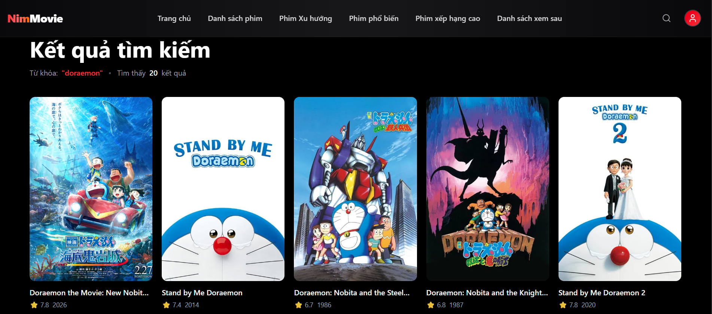
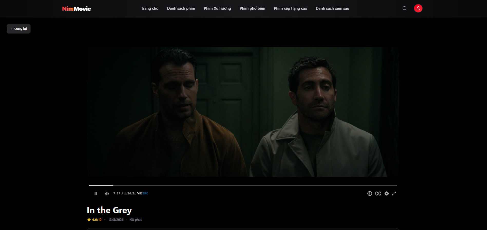
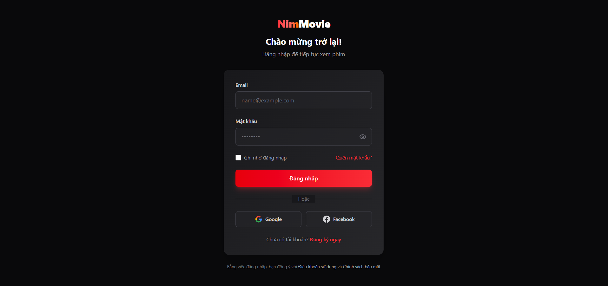
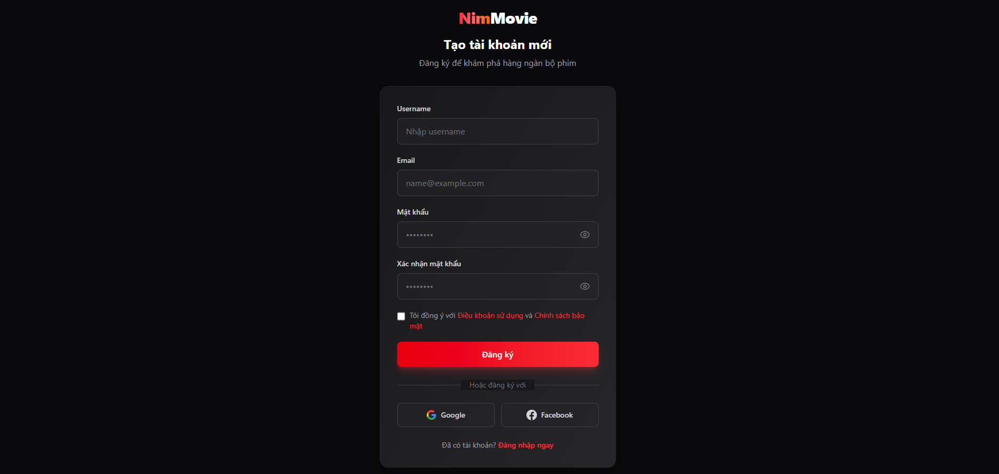
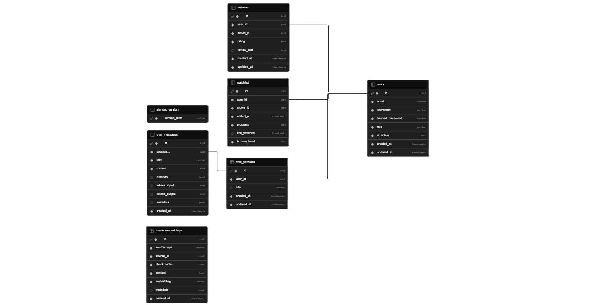

<div align="center">

# Nim Movie

**Nền tảng xem phim trực tuyến tích hợp AI Chatbot**

<p>
  
  
  
  
</p>

<p>
  
  
  
  
  
  
  
</p>

<p>
  <a href="https://nim-movie.vercel.app">
    
  </a>
  <a href="https://nim-movie-production.up.railway.app/docs">
    
  </a>
  <a href="#-kiến-trúc-hệ-thống">
    
  </a>
  <a href="#-getting-started">
    
  </a>
</p>

</div>

---

## � Mục lục

- [📌 Tổng quan](#-tổng-quan)
- [📸 Screenshots](#-screenshots)
- [✨ Tính năng nổi bật](#-tính-năng-nổi-bật)
- [🛠️ Tech Stack](#️-tech-stack)
- [🏗️ Kiến trúc hệ thống](#️-kiến-trúc-hệ-thống)
- [📂 Cấu trúc thư mục](#-cấu-trúc-thư-mục)
- [🚀 Getting Started](#-getting-started)
- [🧪 Testing](#-testing)
- [📡 API Reference](#-api-reference)
- [🗄️ Database Schema](#️-database-schema)
- [🎯 Highlights kỹ thuật](#-highlights-kỹ-thuật-đáng-chú-ý)
- [🚢 Deployment](#-deployment)
- [🗺️ Roadmap](#️-roadmap)
- [🤝 Contributing](#-contributing)
- [📄 License](#-license)
- [👨‍💻 Tác giả](#-tác-giả)

---

## �📌 Tổng quan

**Nim Movie** là một nền tảng xem phim trực tuyến hiện đại được xây dựng theo kiến trúc full-stack, lấy cảm hứng từ Netflix. Project tích hợp dữ liệu phim thực tế từ **TMDB API**, hệ thống xác thực JWT bảo mật, và đặc biệt là một **AI Chatbot RAG (Retrieval-Augmented Generation)** giúp người dùng tìm kiếm, gợi ý phim bằng ngôn ngữ tự nhiên với khả năng trích dẫn nguồn rõ ràng.

Project được thiết kế end-to-end nhằm thể hiện năng lực giải quyết bài toán thực tế: từ việc thiết kế database schema, viết migrations, xây dựng RESTful API, tích hợp Vector Search, streaming response qua SSE, đến việc xây dựng UI responsive và triển khai production.

---

## 📸 Screenshots

<div align="center">

### 🏠 Trang chủ — Home
<!-- docs/images/home.png -->


---

### 🔍 Tìm kiếm & Browse
<!-- docs/images/search.png -->


---

### 🎬 Chi tiết phim — Movie Detail
<!-- docs/images/movie-detail.png -->


---

### ▶️ Trình phát — Watch
<!-- docs/images/watch.png -->


---

### 📝 Watchlist & Profile
<!-- docs/images/watchlist.png -->


---

### 🔐 Authentication
<!-- docs/images/login.png -->
<div>



</div>

---

### 🤖 AI Chatbot RAG
<!-- docs/images/chatbot.png -->


</div>


---

## ✨ Tính năng nổi bật

### 🎥 Core — Movie Streaming
- **Khám phá phim đa chiều**: Trending (day/week), Popular, Top-rated, Discover by genre, theo nguồn dữ liệu từ TMDB API.
- **Trang chi tiết phim**: hiển thị metadata, trailer, cast, similar movies, ratings.
- **Tìm kiếm full-text** với debounce và phân trang phía server.
- **Trình phát video** (`react-player`) hỗ trợ HLS, DASH và nhiều provider (YouTube, Vimeo).
- **Watchlist cá nhân**: thêm/xoá phim yêu thích, đồng bộ qua database.
- **Review & Rating**: người dùng viết đánh giá, chấm sao, và các review này được index vào vector store để phục vụ RAG.

### 🔐 Authentication & Authorization
- **JWT (HS256)** stateless authentication với access token configurable expiry.
- **Password hashing** bằng `bcrypt` (passlib) — chống brute-force và rainbow table.
- **Role-based access control** (User / Admin) cho các endpoint nhạy cảm.
- **Protected routes** ở frontend qua `PrivateRoute` component + Context API.

### 🤖 AI Chatbot RAG (điểm nhấn kỹ thuật)
- **RAG Pipeline hoàn chỉnh**: Embedding → pgvector ANN search → Context assembly → LLM generation → SSE streaming.
- **Multi-provider Embedding**: hỗ trợ `sentence-transformers/all-MiniLM-L6-v2` (local, 384-dim) hoặc `text-embedding-3-small` (OpenAI, 1536-dim) cấu hình qua env.
- **Multi-provider LLM**: pluggable abstraction cho **OpenAI**, **Google Gemini**, và **Groq** — chuyển đổi không cần đổi code.
- **Vector Search hiệu năng cao**: pgvector với index `ivfflat` (cosine similarity) trên Supabase Postgres.
- **Citation Codec**: hệ thống trích dẫn nguồn `[#movie:123]`, `[#review:45]` với parser exception-free và property-based testing đảm bảo round-trip toàn vẹn.
- **Personalization**: ngân sách token riêng cho lịch sử người dùng (watchlist, ratings) đưa vào prompt.
- **Conversation Store**: lưu trữ `chat_sessions`, `chat_messages` với role check và citations JSONB.
- **Token-aware context budgeting** dùng `tiktoken` để cắt context theo `RAG_TOKEN_BUDGET` mà không vượt giới hạn model.
- **Resilience**: retry với exponential backoff (`tenacity`), timeout cấu hình, graceful degradation khi LLM provider lỗi.
- **Rate limiting**: per-minute và per-hour, áp dụng cho endpoint chat để chống lạm dụng.

### ⚙️ Backend Engineering
- **Layered architecture**: API → Schemas (Pydantic) → Services → Repositories/Models → Database.
- **Database migrations** quản lý chặt chẽ qua **Alembic** (initial commit + add chat & vectors).
- **TMDB integration** với HTTP client `httpx` async-ready và caching layer.
- **Cache Manager** abstraction (in-memory) cho embeddings và retrieval results với TTL configurable.
- **Structured logging** bằng `loguru` (app.log + error.log).
- **Centralized error handling** middleware trả về JSON chuẩn hóa.
- **Custom CORS middleware** giới hạn origin theo môi trường.

### 🎨 Frontend Engineering
- **React 19** + **Vite 8** — hot reload nhanh, bundle nhẹ.
- **Tailwind CSS 4** với custom design system, dark mode mặc định.
- **React Router v7** với nested routes và code splitting.
- **Context API** cho global state (Auth, Movie, Settings) — tránh prop drilling.
- **Custom hooks** (`useAuth`, `useMovie`) đóng gói logic tái sử dụng.
- **Service layer** (`axios` instance với interceptor) tự động gắn JWT và refresh khi cần.
- **Responsive UI** mobile-first với carousel (`react-slick`) và icon system (`lucide-react`).

---

## 🛠️ Tech Stack

<table>
<tr>
<th align="center" width="33%">🎨 Frontend</th>
<th align="center" width="33%">⚙️ Backend</th>
<th align="center" width="33%">🧠 AI / Data / Infra</th>
</tr>
<tr>
<td valign="top">


</td>
<td valign="top">


</td>
<td valign="top">


</td>
</tr>
</table>

---

## 🏗️ Kiến trúc hệ thống

```
┌────────────────────────────────────────────────────────────────────────┐
│                          CLIENT (React + Vite)                         │
│   Pages ── Components ── Context ── Hooks ── Services (axios)          │
└────────────────────────────────┬───────────────────────────────────────┘
                                 │ HTTPS / SSE
                                 ▼
┌────────────────────────────────────────────────────────────────────────┐
│                       FastAPI APPLICATION (Backend)                    │
│                                                                        │
│  Middleware:  CORS │ Rate Limit │ Error Handler │ Auth (JWT)           │
│                                                                        │
│  ┌──────────────┐   ┌──────────────┐   ┌──────────────────────────┐    │
│  │  REST API    │──▶│   Services   │──▶│   Models / Repositories  │    │
│  │  (v1 routes) │   │ auth│movie│  │   │  SQLAlchemy + Alembic    │    │
│  │              │   │ chat│review│  │   │                          │    │
│  └──────────────┘   └──────┬───────┘   └────────────┬─────────────┘    │
│                            │                        │                  │
│                            ▼                        ▼                  │
│                  ┌───────────────────┐    ┌────────────────────┐       │
│                  │   AI Subsystem    │    │  Integrations      │       │
│                  │  ─ Embeddings     │    │  ─ TMDB Client     │       │
│                  │  ─ Vector Store   │    │  ─ LLM Provider    │       │
│                  │  ─ RAG Service    │    │  ─ Cache Manager   │       │
│                  │  ─ Citations      │    │                    │       │
│                  └─────────┬─────────┘    └─────────┬──────────┘       │
└────────────────────────────┼────────────────────────┼──────────────────┘
                             │                        │
                ┌────────────▼────────────┐  ┌────────▼────────┐
                │  Supabase Postgres      │  │   External APIs │
                │  + pgvector (ivfflat)   │  │   TMDB / OpenAI │
                │  ─ users, movies cache  │  │   Gemini / Groq │
                │  ─ watchlist, reviews   │  │                 │
                │  ─ chat_sessions/msgs   │  │                 │
                │  ─ movie_embeddings     │  │                 │
                └─────────────────────────┘  └─────────────────┘
```

### RAG Pipeline chi tiết

```
User Query
    │
    ▼
┌─────────────────┐    cache hit     ┌─────────────────┐
│ Embedding Layer │ ───────────────▶ │   Cache Layer   │
│ (local/openai)  │                  │ (TTL config)    │
└────────┬────────┘                  └────────┬────────┘
         │ vector(384|1536)                   │
         ▼                                    │
┌─────────────────────┐                       │
│   pgvector ANN      │                       │
│   ivfflat + cosine  │                       │
│   TOP_K + min_sim   │                       │
└──────────┬──────────┘                       │
           │ retrieved chunks                 │
           ▼                                  │
┌──────────────────────┐    ┌─────────────────────────┐
│  Context Assembly    │◀───│  Personalization Store  │
│  (token budget)      │    │  (watchlist, ratings)   │
└──────────┬───────────┘    └─────────────────────────┘
           │ prompt
           ▼
┌──────────────────────┐
│   LLM Provider       │  retry + timeout (tenacity)
│   OpenAI/Gemini/Groq │
└──────────┬───────────┘
           │ stream tokens
           ▼
┌──────────────────────┐
│  Citation Formatter  │   [#movie:123] [#review:45]
└──────────┬───────────┘
           │ SSE
           ▼
       Frontend
```

---

## 📂 Cấu trúc thư mục

```
nim-movie/
├── backend/                          # FastAPI backend
│   ├── app/
│   │   ├── api/v1/
│   │   │   ├── endpoints/            # auth, movies, users, watchlist,
│   │   │   │                         # reviews, chat, recommendations, admin
│   │   │   └── router.py             # API v1 aggregator
│   │   ├── auth/                     # JWT security & dependencies
│   │   ├── core/                     # logger config (loguru)
│   │   ├── database/
│   │   │   ├── base.py               # SQLAlchemy declarative base
│   │   │   ├── session.py            # engine + SessionLocal
│   │   │   └── migrations/           # Alembic versions
│   │   ├── integrations/
│   │   │   ├── tmdb_client.py        # TMDB API wrapper
│   │   │   ├── llm_provider.py       # OpenAI/Gemini/Groq abstraction
│   │   │   └── cache_manager.py      # TTL cache
│   │   ├── middleware/               # CORS, rate limit, error handler
│   │   ├── models/                   # User, Watchlist, Review,
│   │   │                             # ChatSession, ChatMessage, MovieEmbedding
│   │   ├── schemas/                  # Pydantic v2 request/response models
│   │   ├── services/
│   │   │   ├── ai/
│   │   │   │   ├── embeddings.py     # multi-provider embedding
│   │   │   │   ├── vector_store.py   # pgvector data-access layer
│   │   │   │   ├── rag_service.py    # retrieval orchestration
│   │   │   │   ├── citations.py      # citation codec (parser/formatter)
│   │   │   │   └── prompt_templates.py
│   │   │   ├── auth_service.py
│   │   │   ├── movie_service.py
│   │   │   ├── chat_service.py       # chat orchestration
│   │   │   ├── review_service.py
│   │   │   ├── user_service.py
│   │   │   └── watchlist_service.py
│   │   ├── utils/                    # helpers, validators, exceptions
│   │   ├── config.py                 # Pydantic Settings
│   │   └── main.py                   # FastAPI entry point
│   ├── tests/
│   │   ├── unit/                     # unit tests (pytest)
│   │   ├── property/                 # property-based tests (hypothesis)
│   │   ├── test_auth.py
│   │   ├── test_movies.py
│   │   ├── test_chat.py
│   │   ├── test_recommendations.py
│   │   └── test_ai_services.py
│   ├── scripts/                      # smoke tests, SQL utilities
│   ├── alembic.ini
│   ├── requirements.txt
│   ├── Procfile                      # for deployment (Railway/Render)
│   └── .env.example
│
├── frontend/                         # React + Vite SPA
│   ├── src/
│   │   ├── components/
│   │   │   ├── Auth/                 # PrivateRoute, LoginForm…
│   │   │   ├── Browse/               # genre filters
│   │   │   ├── Common/               # Navbar, Footer, Loader…
│   │   │   ├── Home/                 # Hero, Carousels
│   │   │   ├── Movie/                # MovieCard, MovieGrid
│   │   │   ├── MovieDetail/          # Cast, Trailer, Similar
│   │   │   ├── Profile/
│   │   │   ├── Review/
│   │   │   ├── Settings/
│   │   │   ├── Watch/                # video player wrapper
│   │   │   └── Watchlist/
│   │   ├── context/                  # Auth, Movie, Settings contexts
│   │   ├── hooks/                    # useAuth, useMovie
│   │   ├── pages/                    # 11 route-level pages
│   │   ├── services/                 # API client per domain
│   │   ├── utils/                    # axios instance, constants, tmdb helpers
│   │   ├── styles/globals.css
│   │   ├── App.jsx
│   │   └── main.jsx
│   ├── public/
│   ├── vite.config.js
│   ├── eslint.config.js
│   ├── vercel.json                   # Vercel deployment config
│   └── package.json
│
└── README.md
```

---

## 🚀 Getting Started

### Yêu cầu hệ thống

| Công cụ           | Phiên bản đề xuất |
| ----------------- | ----------------- |
| Python            | 3.11+             |
| Node.js           | 20+               |
| PostgreSQL        | 15+ (kèm pgvector extension) |
| TMDB API key      | bắt buộc          |
| LLM API key       | tùy chọn (OpenAI / Gemini / Groq) |

---

### 1️⃣ Clone repository

```bash
git clone https://github.com/<your-username>/nim-movie.git
cd nim-movie
```

### 2️⃣ Backend setup

```bash
cd backend

# Tạo virtual environment
python -m venv venv
venv\Scripts\activate          # Windows
# source venv/bin/activate     # macOS/Linux

# Cài dependencies
pip install -r requirements.txt

# Cấu hình env
copy .env.example .env         # Windows
# cp .env.example .env         # macOS/Linux
# → Mở .env và điền: DATABASE_URL, JWT_SECRET_KEY, TMDB_API_KEY, LLM keys…

# Chạy migrations (tạo tables + pgvector index)
alembic upgrade head

# Khởi động dev server
uvicorn app.main:app --reload --port 8000
```

Backend sẵn sàng tại `http://localhost:8000`. Swagger UI tại `http://localhost:8000/docs`.

### 3️⃣ Frontend setup

```bash
cd frontend

# Cài dependencies
npm install

# Cấu hình env (tạo .env)
echo VITE_API_URL=http://localhost:8000/api/v1 > .env

# Khởi động dev server
npm run dev
```

Frontend sẵn sàng tại `http://localhost:5173`.

### 4️⃣ Tạo JWT secret key

```bash
python -c "import secrets; print(secrets.token_hex(32))"
```

---

## 🧪 Testing

Project áp dụng nhiều tầng test nhằm đảm bảo correctness của các invariant quan trọng.

```bash
cd backend

# Toàn bộ test suite
pytest

# Unit tests
pytest tests/unit -v

# Property-based tests (hypothesis)
pytest tests/property -v

# Tests cho AI subsystem
pytest tests/test_ai_services.py tests/test_chat.py -v

# Coverage report
pytest --cov=app --cov-report=html
```

**Property-based testing** dùng `hypothesis` cho các invariant như:
- *Citation round-trip*: với mọi danh sách citation hợp lệ và text fragments không chứa pattern, `parse(format(...))` phải trả lại đúng input.
- *Parser exception-free*: với arbitrary unicode input, parser không bao giờ raise; mọi citation output đều khớp grammar.

---

## 📡 API Reference

> Base URL: `http://localhost:8000/api/v1`  ·  Docs tương tác: `/docs` (Swagger), `/redoc` (ReDoc)

### 🔐 Auth
| Method | Endpoint              | Mô tả                                    | Auth |
| ------ | --------------------- | ---------------------------------------- | ---- |
| POST   | `/auth/register`      | Đăng ký user mới, trả về JWT             | ❌   |
| POST   | `/auth/login`         | Đăng nhập, trả về `access_token`         | ❌   |
| GET    | `/auth/me`            | Thông tin user hiện tại                  | ✅   |

### 🎬 Movies
| Method | Endpoint                       | Mô tả                                    |
| ------ | ------------------------------ | ---------------------------------------- |
| GET    | `/movies/trending`             | Phim trending theo `day` hoặc `week`     |
| GET    | `/movies/popular`              | Phim phổ biến                            |
| GET    | `/movies/top-rated`            | Phim top-rated                           |
| GET    | `/movies/discover`             | Discover theo genre / năm / sort         |
| GET    | `/movies/search?q=`            | Full-text search                         |
| GET    | `/movies/{id}`                 | Chi tiết phim + trailer + cast           |
| GET    | `/movies/genres`               | Danh sách thể loại                       |

### 👤 Users / Watchlist / Reviews
| Method | Endpoint                       | Mô tả                                    |
| ------ | ------------------------------ | ---------------------------------------- |
| GET    | `/users/me`                    | Profile user                             |
| PATCH  | `/users/me`                    | Cập nhật profile                         |
| GET    | `/watchlist`                   | Lấy watchlist                            |
| POST   | `/watchlist`                   | Thêm phim vào watchlist                  |
| DELETE | `/watchlist/{movie_id}`        | Xoá khỏi watchlist                       |
| POST   | `/reviews`                     | Tạo review (trigger reindex embedding)   |
| GET    | `/reviews?movie_id=`           | Lấy reviews của phim                     |

### 🤖 AI Chatbot
| Method | Endpoint                       | Mô tả                                    |
| ------ | ------------------------------ | ---------------------------------------- |
| POST   | `/chat/sessions`               | Tạo session chat mới                     |
| GET    | `/chat/sessions`               | Lịch sử các session của user             |
| GET    | `/chat/sessions/{id}/messages` | Toàn bộ messages của session             |
| POST   | `/chat/sessions/{id}/messages` | Gửi message, nhận response (SSE stream)  |
| POST   | `/admin/chat/reindex`          | Re-embed toàn bộ movies/reviews          |
| GET    | `/admin/chat/stats`            | Thống kê chatbot (admin only)            |

### 🩺 Health
| Method | Endpoint            | Mô tả                       |
| ------ | ------------------- | --------------------------- |
| GET    | `/`                 | Liveness check              |
| GET    | `/health/db`        | Database connectivity check |

---

## 🗄️ Database Schema

Toàn bộ schema được host trên **Supabase Postgres** với extension `pgvector` và `pgcrypto`. Dưới đây là sơ đồ ER (Entity Relationship Diagram) export từ Supabase Studio:

<div align="center">



</div>

**Các bảng chính:**

| Bảng                | Mục đích                                                   | Ghi chú                                            |
| ------------------- | ---------------------------------------------------------- | -------------------------------------------------- |
| `users`             | Tài khoản người dùng (email, password hash, role)          | bcrypt hashed password                             |
| `watchlist`         | Phim đã thêm vào watchlist của user                        | composite key (user_id, movie_id)                  |
| `reviews`           | Đánh giá / chấm sao của user cho phim                      | trigger reindex vào `movie_embeddings`             |
| `chat_sessions`     | Phiên hội thoại của user với chatbot                       | UUID PK, index theo `(user_id, updated_at DESC)`   |
| `chat_messages`     | Tin nhắn trong session, kèm citations                      | role check, citations JSONB                        |
| `movie_embeddings`  | Vector embeddings cho RAG (movie & review chunks)          | pgvector + `ivfflat` index, cosine similarity      |

---

## 🚢 Deployment

### Frontend (Vercel)
Repo đã có `vercel.json`. Push lên GitHub → import vào Vercel → set `VITE_API_URL` → deploy.

### Backend (Railway)
Repo có `Procfile`:
```
web: uvicorn app.main:app --host 0.0.0.0 --port $PORT
```

---

## 🗺️ Roadmap

- [x] CRUD movies/users/watchlist/reviews
- [x] JWT authentication + RBAC
- [x] TMDB integration với cache
- [x] AI Chatbot RAG end-to-end (embedding → pgvector → LLM → SSE)
- [x] Citation codec + property-based tests
- [x] Multi-provider LLM (OpenAI / Gemini / Groq)
- [x] Database migrations với Alembic
- [ ] Redis cache layer (thay in-memory)
- [ ] Background jobs cho re-embedding (Celery/RQ)
- [ ] Hybrid search (BM25 + vector)
- [ ] Recommendation engine collaborative filtering
- [ ] OAuth2 social login (Google, GitHub)
- [ ] CI/CD pipeline với GitHub Actions
- [ ] Containerize với Docker Compose

---

## 🤝 Contributing

Project hiện đang trong giai đoạn phát triển cá nhân. Nếu bạn quan tâm hoặc có feedback, mở issue hoặc PR đều được chào đón.

```bash
# Convention commit
feat: add new feature
fix: fix a bug
docs: documentation only
refactor: code change without changing behavior
test: adding tests
chore: tooling, dependencies, build
```

---

## 📄 License

Distributed under the **MIT License**. Xem `LICENSE` để biết chi tiết.

---

## 👨‍💻 Tác giả

<div align="center">

**Nhật Minh**

<p>
  <a href="mailto:minh2m5@example.com">
    
  </a>
  <a href="https://github.com/nNm205">
    
  </a>
</p>

</div>

---

<div align="center">

**Nếu project hữu ích, đừng quên ⭐ star repository nhé!**

*Built with ☕ and a lot of `git commit --amend`*

</div>
